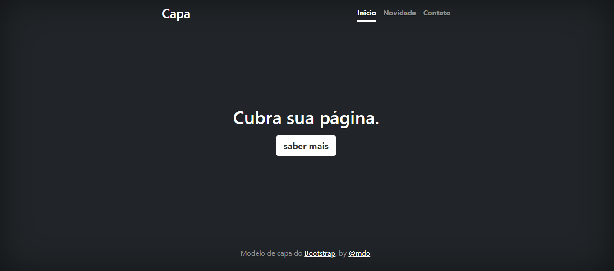

# Índice 

[Projeto - Aprendendo a escrever um README](#projeto---aprendendo-a-escrever-um-readme)  
[Descrição](#descri%C3%A7%C3%A3o)  
[Introdução](#introdu%C3%A7%C3%A3o)  
[Funcionalidades](funcionalidades)  
[Tecnologias Utilizadas](#tecnologias-utilizadas)  
[Fontes consultadas](#fontes-consultadas)  
[Autores](#autores)  

# Projeto - Aprendendo a escrever um README

## Descrição 

## Introdução

## Funcionalidades

### Tecnologias utilizadas

## Fontes consultadas 
[https://gist.github.com/lohhans/f8da0b147550df3f96914d3797e9fb89
https://www.alura.com.br/artigos/escrever-bom-readme]

## Autores

